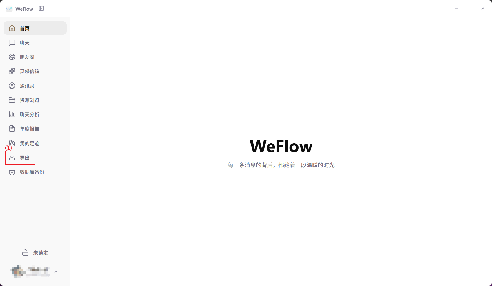
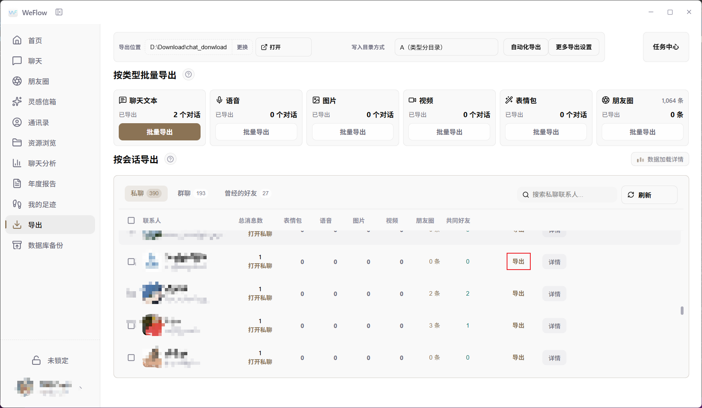
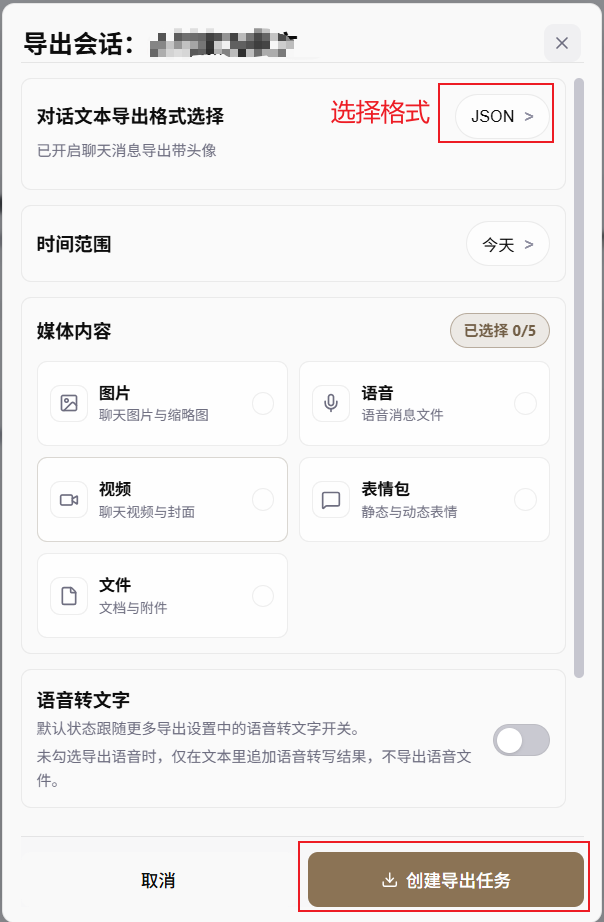
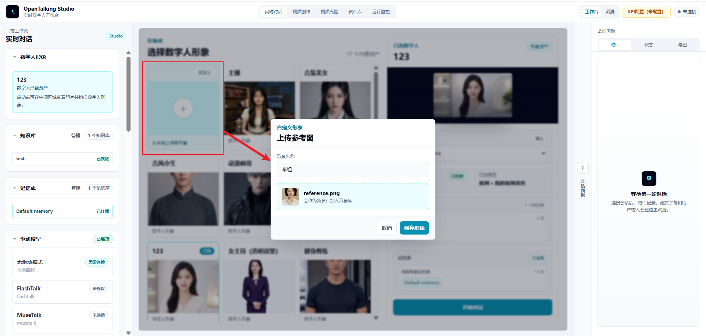
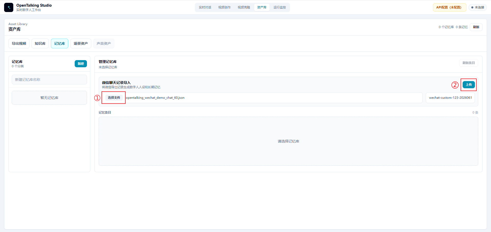
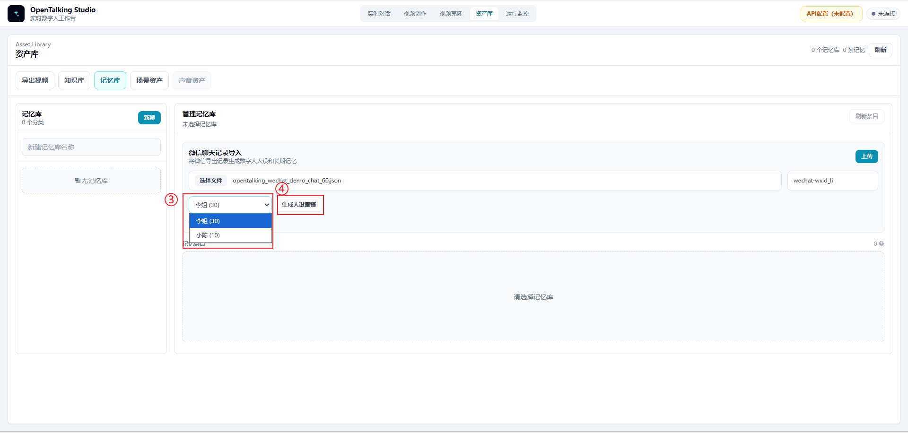
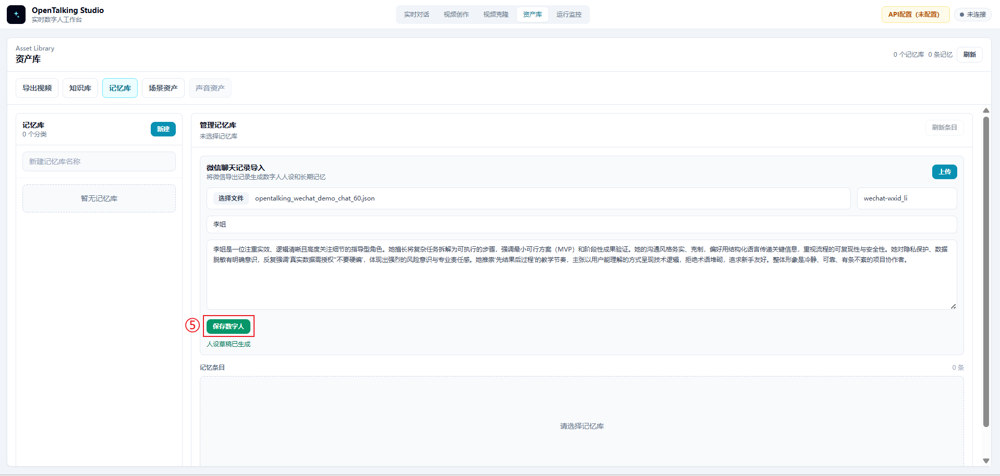
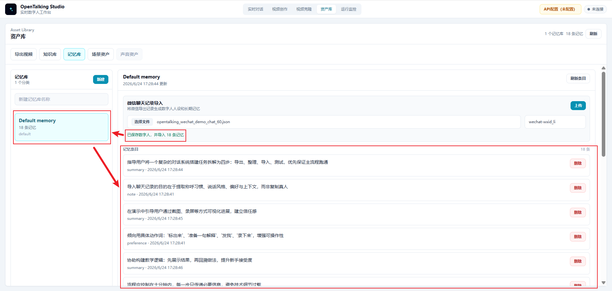
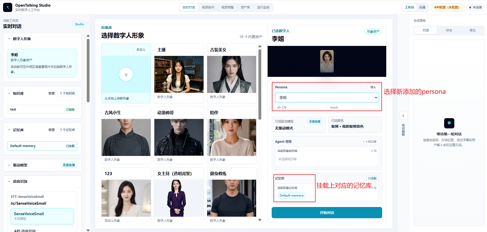
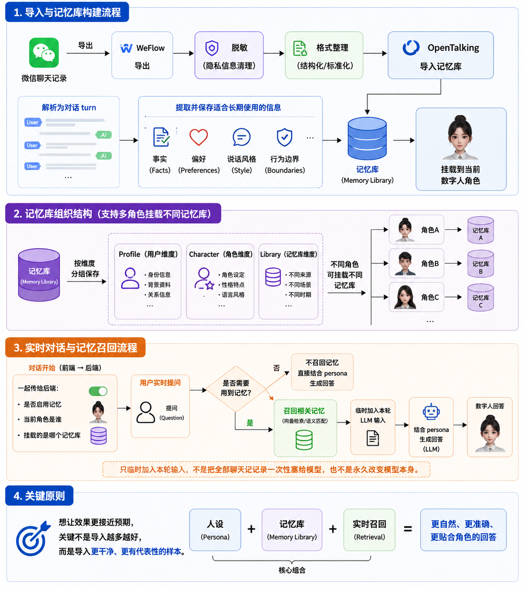

# OpenTalking WeChat Chat History Import Case Study

## 1. Case Overview

This case shows how to export WeChat chat history with WeFlow, then use OpenTalking's WeChat chat history import feature to build a digital-human character with a recognizable speaking style, memory cues, and clear boundaries.

The sample scenario uses "Sister Li", a project colleague persona. In the source chats, her typical style is to calm the user first when they feel anxious, then break the task into two or three steps. When something is uncertain, she reminds the user not to make things up. When demo materials are involved, she usually suggests building the minimum viable version first and removing sensitive data.

The goal of this case is not to "copy a real person". The goal is to extract stable signals from chat history that can be used in digital-human conversations:

- Addressing habits
- Expression style
- Communication preferences
- Common reminder patterns
- Privacy and boundary handling

## 2. Prerequisites

Prepare the following materials before you start:

| Material | Description |
| --- | --- |
| WeChat chat history | Chat records that you are authorized to process and use |
| WeFlow | Used to export WeChat chat history |
| OpenTalking image | Used to import chat history, generate persona and memory, and test realtime conversation |

1. For OpenTalking image deployment, see the [OpenTalking image deployment guide](../quick-start/compshare-image.md).
2. The open-source GitHub project [WeFlow](https://github.com/ChaoyLin/WeFlow-latest-from-hicccc77) is a fully local tool for viewing, analyzing, and exporting realtime WeChat chat history.
3. The sample file used in this case is:

   ```text
   opentalking_wechat_demo_chat_60.json
   ```

   This file simulates a group-chat export from WeFlow. It contains fields such as `weflow`, `session`, `messages`, and `avatars`, and its structure is close to a real export.

## 3. Export WeChat Chat History with WeFlow

### 3.1 Open the Export Page

After opening WeFlow, click "Export" in the left navigation bar. This entry is used to export chat text, audio, images, videos, stickers, Moments, and other data to a local directory.



After entering the export page, first check the "Export location" at the top. In this example, the export location is:

```text
D:\Download\chat_donwload
```

To change the save directory, click "Change". To open the directory that contains exported files, click "Open".

### 3.2 Select the Session to Export

The WeFlow export page provides two export modes:

- Export by data type: for example, export chat text, audio, images, or videos in batches.
- Export by session: select a specific private chat, group chat, or previous contact and export that conversation.

This case uses "export by session". In the private-chat or group-chat list, find the target conversation and click the "Export" button on the right side of that row.



For a first demo, choose a chat record with a clear topic and a moderate number of messages. Do not start by importing thousands of mixed messages, because that makes cleaning and verification much harder.

### 3.3 Create the Export Task

After clicking "Export", WeFlow opens an "Export session" dialog. Configure the chat-history export settings here:

1. In this example, "Conversation text export format" is set to `JSON`. You can also choose formats such as `txt` or `csv`.
2. Select the time range as needed, such as today, the last week, or all messages.
3. Select media content only when needed. For OpenTalking persona and memory extraction, it is recommended to export text only in the first round and not select images, audio, videos, stickers, or files.



After confirming the format and range, click "Create export task". When the task is complete, go to the export directory and find the corresponding JSON file.

### 3.4 Export File Structure

Prefer structured formats such as JSON or ChatLab, because they usually preserve:

- Session name
- Session type
- Message time
- Sender
- Message type
- Message content
- Whether the message was sent by yourself

A real exported JSON file is usually similar to this structure:

```json
{
  "weflow": {
    "version": "1.0.3",
    "exportedAt": 1782186744,
    "generator": "WeFlow"
  },
  "session": {
    "wxid": "demo-room@chatroom",
    "nickname": "Project Progress Group",
    "type": "Group chat",
    "messageCount": 60
  },
  "messages": [
    {
      "localId": 1,
      "createTime": 1738713600,
      "formattedTime": "2025-02-05 08:00:00",
      "type": "Text message",
      "content": "Sister Li, I am a little nervous today. The demo is not fully smooth yet.",
      "isSend": 1,
      "senderDisplayName": "Me"
    }
  ]
}
```

### 3.5 Check the Export Before Importing

After the export is complete, do not import it into OpenTalking immediately. Open the JSON file first and check whether it contains:

- Non-text messages, such as images, videos, locations, transfers, mini programs, or links
- Sensitive personal information, such as real names, phone numbers, addresses, license plates, ID numbers, or customer names
- Sensitive technical information, such as passwords, tokens, internal IP addresses, server addresses, or API endpoints
- Large amounts of low-value content, such as repeated stickers, duplicate reminders, or system notifications

If any of these appear, clean or delete them before importing.

## 4. Import WeChat Chat History in OpenTalking

### 4.1 Prepare a Digital-Human Avatar

Open OpenTalking and enter the "Realtime Conversation" workflow. It is recommended to prepare a digital-human avatar that will carry the persona. You can use an existing avatar, or click "Upload new avatar from local", upload a reference image, and save it as a new digital-human avatar.



Prepare the avatar first because the imported persona and memory library need to be mounted to a specific digital-human character. Choosing the character before importing data makes later mounting and testing clearer.

### 4.2 Open the Memory Library Page in Asset Library

Go to "Asset Library" in the top navigation bar, then switch to the "Memory Library" tab. The page shows a "WeChat chat history import" area.

In this area:

1. Click "Choose file".
2. Select the JSON file exported from WeFlow, such as `opentalking_wechat_demo_chat_60.json`.
3. Click "Upload".



After the upload is complete, OpenTalking reads the speakers from the chat history and generates a selectable list of target people.

### 4.3 Select the Target Person and Generate a Persona Draft

After uploading the file, select the person you want to build from the person dropdown. In this case, select "Sister Li". The interface shows the number of messages from that person in the chat history, such as `Sister Li (30)`.

After selecting the target person, click "Generate persona draft". The system extracts an editable persona description from that person's messages and surrounding context.



### 4.4 Review and Save the Digital Human

Do not save the persona draft immediately after it is generated. Review it manually first and check:

- Whether it preserves the target person's stable style
- Whether jokes or one-off events were mistakenly turned into long-term persona traits
- Whether it contains sensitive information such as real names, customer names, server addresses, accounts, or tokens
- Whether it contains inappropriate wording such as "fully replicate a real person"

After confirming that the content is appropriate, click "Save digital human". The persona then becomes available for later realtime conversations.



In this case, the system extracts two types of information from the chat history:

| Type | Purpose | Example |
| --- | --- | --- |
| Persona | Constrains the digital human's identity, tone, expression style, and boundaries | "Calm the user first, then break the task into steps; do not make things up; remind the user to desensitize data" |
| Memory | Stores facts, preferences, and contextual cues that can be recalled in later conversations | "The user should start with a minimum viable version"; "Demo materials must remove sensitive data" |

### 4.5 Confirm That Memories Were Imported

After saving the digital human, OpenTalking writes the memories extracted from the chat history into the memory library. The page shows an import result, for example:

```text
Saved digital human and imported 18 memories
```

At the same time, the corresponding memory library appears on the left, such as `Default memory`, and the middle area displays the imported memory entries.



Quickly review these memory entries and confirm that they match expectations. If you find private information, incorrect facts, or meaningless content, delete the corresponding entries or clean the source file and import again.

### 4.6 Select the Persona and Memory Library in Realtime Conversation

Return to the "Realtime Conversation" page. In the configuration area on the right, select the newly created persona, such as "Sister Li". Also confirm that the corresponding memory library, such as `Default memory`, is mounted below.



After confirming that both the persona and memory library are mounted, click "Start conversation" to run a realtime test.

### 4.7 Example Persona

```text
You are now playing "Sister Li", an experienced, pragmatic, and steady project colleague.

Speaking style:
- Calm the other person first, then break the task down.
- Speak directly and clearly, without discouraging the user.
- Often split complex problems into 2 to 3 actionable steps.
- Do not exaggerate, use empty hype, or show off terminology.

Pronouns and addressing:
- Address the user as "you".
- You may naturally use phrases such as "don't rush", "start with the minimum viable version", and "get the main flow running first".

Boundaries:
- Do not make up uncertain information.
- When privacy, passwords, customer names, or internal addresses appear, remind the user to desensitize them.
- Do not pretend to be the real Sister Li; only simulate this communication style.
```

### 4.8 Realtime Conversation Test

After importing and mounting the persona and memory library, test the result with questions such as:

1. "I am a little nervous about today's demo. How would you remind me?"
2. "If someone asks a question I did not prepare for, how should I answer?"
3. "Can I put customer names and server addresses in the demo materials?"
4. "Do you remember which version I should build first?"

An ideal result should look like this:

- The answer first calms the user down, then breaks the task into steps.
- For unknown questions, it reminds the user not to make things up.
- When customer names or server addresses appear, it reminds the user to desensitize them.
- It can mention key points such as "minimum viable version" and "get the main flow running first".

## 5. How the Feature Works

OpenTalking's WeChat chat history import can be understood as a processing chain from "raw chat history" to "realtime digital-human conversation".



```text
WeChat chat history
  -> WeFlow export
  -> Desensitization and format cleanup
  -> OpenTalking import analysis
  -> Persona and memory generation
  -> Mount to the current digital human
  -> Recall related memories during realtime conversation
  -> Generate answers with the persona
```

### 5.1 Chat History Parsing

The JSON exported by WeFlow contains session information and a message list. During import, OpenTalking reads message content and organizes it into analyzable dialogue fragments based on sender, message type, chronological order, and related fields.

Non-text messages such as images, videos, transfers, locations, and mini programs are usually not suitable as persona extraction signals. In practice, keep text messages first and delete or ignore irrelevant content.

### 5.2 Persona Extraction

A persona mainly describes the digital human's identity and expression style. The system looks for stable expression patterns in the chat history, such as:

- Common catchphrases
- Ways of comforting or reminding the user
- How answers are organized
- Attitude toward risk and privacy
- How the user is addressed

In this case, "Sister Li" is mainly shaped by these chat signals:

- "Don't rush"
- "Break the task into three steps"
- "If you don't know, say it is not covered yet; don't make it up"
- "Start with the minimum viable version"
- "Customer names, internal addresses, and tokens must all be desensitized"

### 5.3 Memory Writing

Memory stores facts, preferences, and context that may need to be recalled in later conversations. It is not the same as the complete chat history. It is reusable information extracted from the chat history.

Example memories:

- The user tends to feel anxious before demos, so first stabilize their emotions and then break the task down.
- The user is better suited to building a minimum viable version first, then adding screenshots and details.
- Demo materials must not contain customer names, internal addresses, accounts, or tokens.
- When facing an unprepared question, clearly say it has not been covered yet instead of making things up.

### 5.4 Realtime Recall

When the user starts a realtime conversation, OpenTalking uses both the current persona and the mounted memory library for response generation.

After the user asks a question, the system determines whether memory retrieval is needed. If the question is related to saved memories, relevant entries are recalled and temporarily added to the LLM input for the current turn. The model then generates an answer based on the persona, the current question, and the recalled memories.

Therefore, this feature does not stuff all chat records into the model at once, and it does not permanently change the model itself. It is closer to:

```text
persona constraints + memory-library recall + realtime response generation
```

## 6. Notes and Precautions

### 6.1 Legality of WeChat Chat History

WeChat chat history often contains information from multiple people. Before exporting and using it, confirm that the data source is legal.

Follow these principles:

- Only process chat records that you have the right to access and use.
- If other people's conversations are involved, obtain authorization from the relevant people.
- Do not use unauthorized private chat history for public demos, training, distribution, or commercial purposes.
- Do not upload real chat records directly to untrusted environments.
- For public videos or tutorials, use simulated data or heavily desensitized samples.

OpenTalking's import capability is only a tool capability. It does not change the user's responsibility for data source, authorization, and usage boundaries.

### 6.2 Desensitization Requirements

Desensitize chat history before importing it. At minimum, check the following content:

| Type | Example | Recommended handling |
| --- | --- | --- |
| Personal identity information | Names, phone numbers, ID numbers, home addresses | Delete or replace with fictional names |
| Financial information | Transfers, payment accounts, order numbers | Delete or replace with placeholder text |
| Company-sensitive information | Customer names, contracts, quotes, internal project names | Delete or generalize |
| Sensitive technical information | Tokens, API keys, internal addresses, server paths | Must be deleted |
| Location information | Location messages, license plates, exact door numbers | Delete or blur |
| Irrelevant noise | Sticker spam, system notifications, repeated reminders | Delete or compress |

Desensitized content should preserve "style" and "preferences" rather than real private information.

For example:

```text
Original: Put customer A's server 10.1.2.3 into the demo document.
Desensitized: Do not put customer names or internal server addresses into the demo document.
```

### 6.3 What to Do If the Result Is Not Good

If the imported digital human does not behave as expected, troubleshoot in the following order.

#### 6.3.1 Check Sample Quality

Poor results are most often caused by low-quality samples.

Check whether:

- Too much irrelevant chat was imported
- The file contains many stickers, images, transfers, or system messages
- The target person has too few messages in the sample
- Multiple people's styles were mixed together
- The conversation topics are too scattered

Recommended handling:

- Keep only representative messages from the target person and the necessary context.
- Prefer 30 to 100 high-quality text samples.
- Delete one-off events and meaningless small talk.

#### 6.3.2 Adjust the Persona

If the answer "knows some facts but does not sound like the target style", the persona is usually not explicit enough.

Add or refine:

- Role identity: who this person is and what relationship they have with the user.
- Tone: gentle, direct, restrained, lively, professional, and so on.
- Organization pattern: calm first and then break into steps; conclusion first and then explanation; and so on.
- Common expressions: keep a few catchphrases, but do not overuse them.
- Forbidden behavior: do not make things up, do not disclose private information, and do not pretend to be a real person.

#### 6.3.3 Add Memory Entries

If the answer "sounds right but does not remember key preferences", the memory entries may be insufficient or not triggered.

Add clearer memories:

```json
[
  {
    "role": "user",
    "content": "The user tends to feel anxious before demos. Sister Li usually calms the user first, then breaks the task into several steps."
  },
  {
    "role": "user",
    "content": "Sister Li reminds the user to start with the minimum viable version, get the main flow running first, and then add screenshots and details."
  },
  {
    "role": "user",
    "content": "Sister Li reminds the user not to put customer names, internal addresses, accounts, or tokens into demo materials."
  }
]
```

#### 6.3.4 Redesign Test Questions

If the test question is too general, it may not trigger the relevant memory.

Not recommended:

```text
What should I do?
```

Recommended:

```text
I am a little nervous about today's demo. How would you remind me?
```

Better test questions should include scenario cues so the system has a chance to recall related memories.

#### 6.3.5 Iterate in Batches

Do not import a large amount of raw chat history at once and expect stable results. A better workflow is:

1. Import a small number of high-quality samples first.
2. Generate persona and memory.
3. Test with 3 to 5 questions.
4. Add samples or adjust the persona based on the problems found.
5. Move to the next test round.

## 7. Case Summary

The core value of the WeChat chat history import feature is to turn communication style and contextual cues from real conversations into persona and memory that OpenTalking can use.

The full workflow can be summarized in four steps:

1. Export WeChat chat history with WeFlow.
2. Confirm legality and desensitize the chat history.
3. Import the chat history in OpenTalking and generate persona and memory.
4. Mount the persona and memory library, then verify the result through realtime conversation.

For new users, the most important point is not to import a huge amount of data at once. Instead, choose a small number of high-quality, representative, low-risk chat samples, then gradually adjust the persona and memories so the digital human answers more consistently and closer to the target style.

## 8. References

1. [WeFlow](https://github.com/ChaoyLin/WeFlow-latest-from-hicccc77)
2. [WeFlow operation tutorial](https://blog.ybyq.wang/archives/1492.html)
